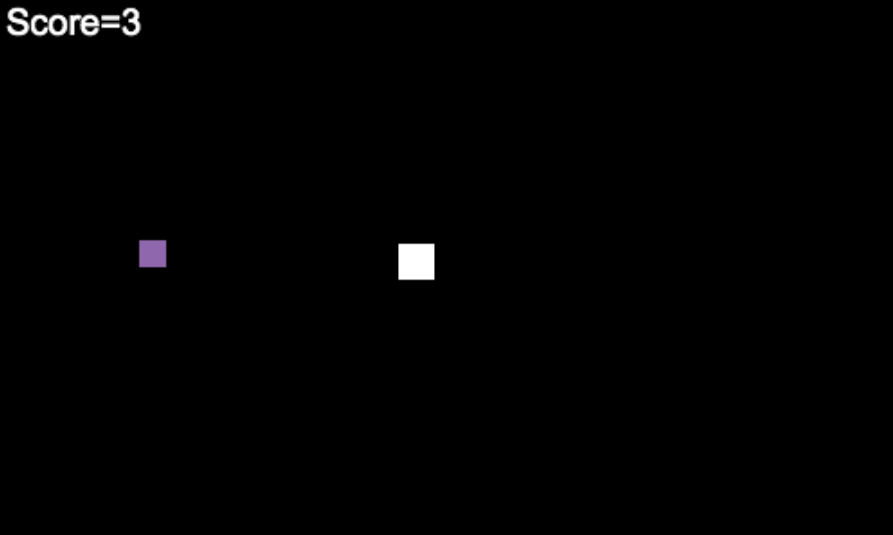

# Snake game
## Description 
In the Snake Game, the player controls the movement of a snake with the up/down/left/right keyboard keys. The aim is to move the snake towards a target apple to eat it, without falling off the edges of the screen. A score system keeps track of the player’s progress. The snake's movement get faster as the game goes. The color of the food will change each time after the snake eats it.

## Link to game
https://trinket.io/python/e6a39e94df

## Screenshots

